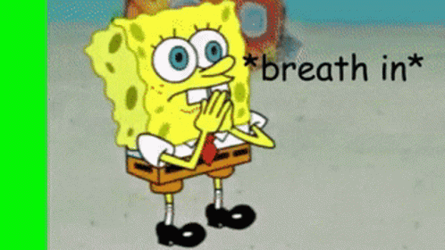

# My_Resume
Capstone Project 1

Link to website: https://jgumtang.github.io/My_Resume/

My pfp: ./assests/my_picture.jpg

#D4B996FF
#195190FF
  

        <a href="https://www.youtube.com/channel/UC1r1cNBYg6wTn3tD7BGRyuA" class="youtube">Check out my YT!</a>

          </header>

  

    

      
Hello! My name is Jeanella, and I pursue in becoming a Web developer eventually!
      

  

      <h2>Education (Attended schools):</h2>
        <ul>
          <li><a href="https://www.gcpsk12.org/CorleyES">Corley Elementary School</a></li>
          <li><a href="https://www.gcpsk12.org/SweetwaterMS">Sweetwater Middle School</a></li>
          <li><a href="https://www.gcpsk12.org/NorthbrookMS">Northbrook Middle School</a></li>
          <li><a href="https://www.gcpsk12.org/BrookwoodHS">Brookwood Highschool</a></li>
        </ul>
    

    

   

     <h2>Work Experiences:</h2>
         <ul class="experience">
            <li>Currently unemployed</li>
         </ul>  
        

     <h2>Skills:</h2>
         <ul>
           <li>Reference Art/drawing:★★★</li>
           <li>Video Editing ★★★</li>
           <li>Computer Naviagtion: ★★★</li>
           <li>Gaming: ★★★★</li>
         </ul> 
        

    

 

      

 

    <h2>Certification(s):</h2>
    <ul>
       <li>Spelling Bee - Sweetwater MS (2019-2020)</li>
   </ul>

  

    <footer class="isolated">
      
@ 2023 Jeanella Gumtang. All rights reserved.

    </footer>

    CSS section: 

    
* {
    margin: 0;
    padding: 0;
    box-sizing: border-box;
    font-family: 'Balthazar', serif;
}

body {
    margin-top: 80px    ;
    height: 100%;
    min-height: 150vh;
    background-color: #8ABAD3FF;
}

.header {
    background-color: #1C1C1BFF;
    display: flex;
    justify-content: space-between;
    align-items: center;
    z-index: 100;
    position: fixed;
    top: 0;
    left: 0;
    width: 100%;
    min-height: 70px;
    padding: 20px 150px;
    backdrop-filter: blur (5px);

}

.name-header {
    float: left;
    font-size: 38px;
    color: #ffffff;
    font-weight: bold;

}

.navbar a {
    font-size: 20px;
    color: #ffffff;
    font-weight: normal;
    text-decoration: none;
    margin-left: 40px;
}

.link-animation {
    box-shadow: inset 0 0 0 0 #54b3d6;
    color: #000000;
    margin: 0 -.25rem;
    padding: 0 .25rem;
    transition: color .3s ease-in-out, box-shadow .3s ease-in-out;
}

.link-animation:hover {
    box-shadow: inset 100px 0 0 0 #54b3d6;
    color: white;
  }

.logo {
    display: flex;
    flex-basis: auto;
    justify-content: center;
    align-items: center;
    margin: 3%;
    padding: 3%;
}
.first-image {
    display: flex;
    justify-content: center;
    align-items: center;
    width: 260px;
    height: 250px;
}

.body-spacing {
    position: fixed;
    top: 0;
    display: flex;
    flex-basis: auto;
    justify-content: center;
    align-items: center;
}

ul li {
    display: flex;
    flex-basis: auto;
    justify-content: center;
    align-items: center;
    text-decoration: none;
}

hr {
    width: 0;
    margin-top: 1.6%;
    margin-bottom: 2%;
}

h1, h2{
    display: flex;
    flex-basis: auto;
    justify-content: center;
    align-items: center;
    color:#FFFFFF;
    padding: 0.5%;
    margin: 0.5%;
}

.first-p {
    padding-left: 20px;
    display: flex;
    flex-basis: auto;
    justify-content: center;
    align-items: center;
    color: #ffffff;
    font-weight: 500;
    font-size: 20px;
}

footer {
    float: right;
}

